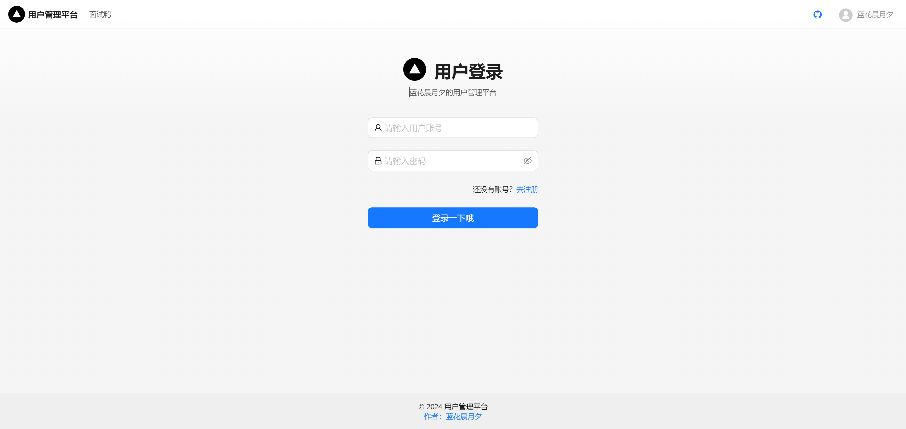
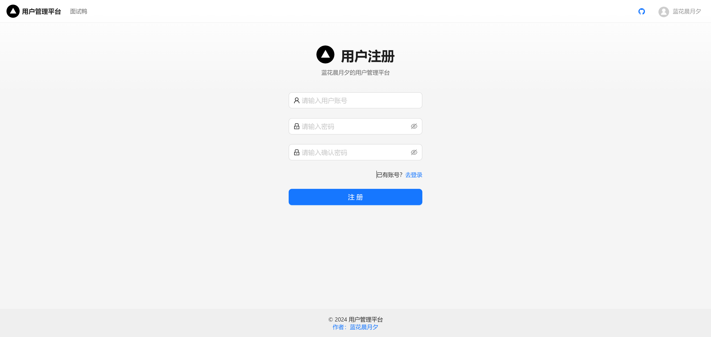
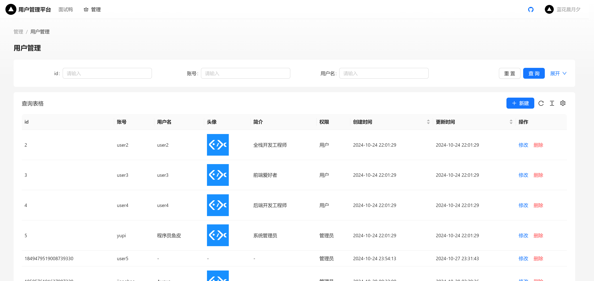

## 用户管理系统模版 
后端模版直接放在目录的压缩包里了
如果前端npm install失败，可以从网盘下载
百度网盘下载对user-manager-demo进行解压

通过百度网盘分享的文件：user-manager-demo.zip
链接：https://pan.baidu.com/s/1bfDmbn_5DpnZssXwouR-Jw?pwd=asyg
提取码：asyg
--来自百度网盘超级会员V8的分享

用于开发方便，可以直接套用前后端进行开发。

### 前端展示

#### 登录页面

#### 注册页面

#### 管理页面

